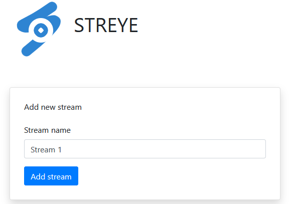
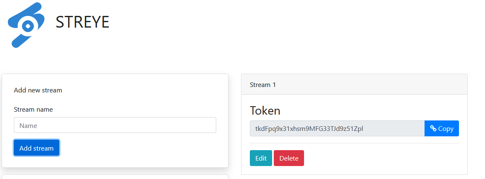
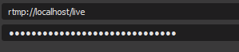
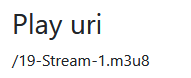
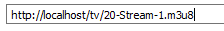
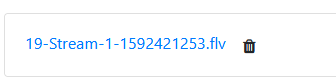

Streye is a private streaming (RTMP) server with a web interface. All streamed videos are recorded and saved in real time on the server.

- Generates private token for streaming
- Generates public link to share with others
- Download video link when stream is done
- Basic nginx htpasswd authentication

## How it works

Go to the address of the server on a browser and log in (by default, username: streye and password: eyerts).

Create a stream



Copy generated token



Go to streaming software (OBS on the screenshot) and fill with rtmp://"ip address"/live. For the key, paste the generated token previously copied.



Start streaming and refresh streye web app to get public link

 

You can play the stream on a dedicated M3U player such as VLC. The link will be formatted as http://"ip address"/tv/"play uri".



Once you are done with the stream, you can download the video file via the web app.



## Components

- Use nginx-rtmp as rtmp server
- Use svelte for the frontend
- Use golang app for backend with an embedded database
  
## Pre-requirements

- Docker
- Docker-compose

## Installation

This command will start the rtmp and the web server:

`docker-compose up --build`

## Authentication

You can change username and password in docker-compose.yml line 17:

```
args: 
- username=streye
- password=eyerts
```

By default, the username is set to streye and the password to eyerts.

## Push stream to others platforms

In addition to streaming on this private server, pushing to others platforms makes multicast possible.

### Twitch

In frontend/nginx.conf, you can change line 79

`push rtmp://live-cdg.twitch.tv/app/$arg_twitch_key;`

And replace $arg_twitch_key with your own twitch key

You can either restart all containers or access streye-frontend container and reload nginx service.

### Others

Following frontend/nginx.conf line 79, `push rtmp://live-cdg.twitch.tv/app/$arg_twitch_key;`, you can add another push line with this syntax:

`push rtmp://<link to other rtmp server with key>;`

You can either restart all containers or access streye-frontend container and reload nginx service.

## To backup all videos

In root folder, when app is running: 

`docker cp streye-frontend:/tmp/rec/ .`

All videos will be copied in the generated rec folder.

## To do

- Find a way to dynamically set twitch key